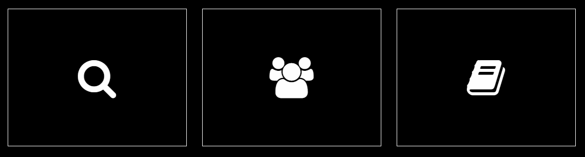
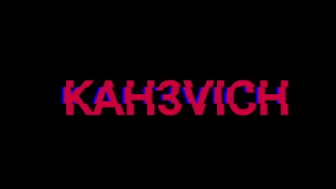
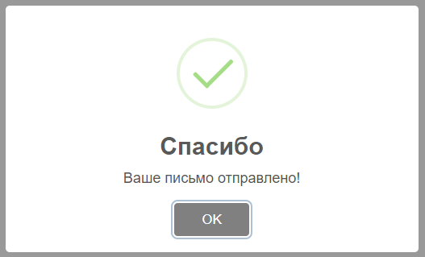
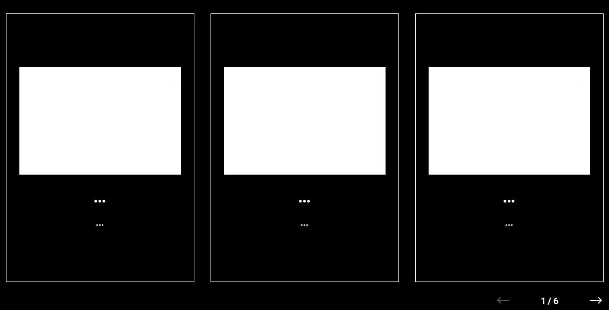
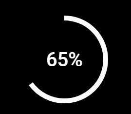

# Link to the project : [🐉](https://kah3vich.github.io/Project-Portfolio/)

# Testing :
- #### Opera - ✅
- #### Chrome - ✅
- #### Yandex - ❌
- #### Mozilla - ❌
- #### IE - ❌

# The main part of the project :

## 1. Scroll on the page 
#### For its work you will need :
- ##### Library [Jquery 3.5.1](https://jquery.com/download/)
- ##### Library [NiceScroll 3.5.1.jq](https://github.com/inuyaksa/jquery.nicescroll)

#### Code :
HTML :
```
<script src="https://code.jquery.com/jquery-3.5.1.min.js"></script>
<script src="https://cdnjs.cloudflare.com/ajax/libs/jquery.nicescroll/3.7.6/jquery.nicescroll.min.js"></script>
```
JS :
```
$(function() {  
  $("body").niceScroll({ // indicate where the scroll will work
    scrollspeed: 9, // scroll speed
    mousescrollstep: 9, // scroll speed with the mouse wheel
    cursorcolor: "transparent", // scroll color
    cursorborder: "1px solid transparent", // scroll outline
  });
});
```
##### Note: in the documentation for the library [NiceScroll.jq 3.5.1](https://github.com/inuyaksa/jquery.nicescroll) there are many other parameters that you may need, I showed only the parameters I need.

## 2. Icons

### For its work you will need :
- ##### Library with icons [Font Awesome](https://fontawesome.com)
#### Code :
- ##### Go to them [site](https://fontawesome.com) and look for the desired icon by name, and connect
HTML :
```
<i class="fa fa-github" aria-hidden="true"></i>
```

## 3. Animation on the page

#### The project used 2 libraries for animation: wow and gsap
### WOW :
- ##### libraries [WOW 1.0.1.js](https://wowjs.uk)
- ##### libraries [WOW 3.1.0.css ](https://animate.style)
#### Code :
- ##### We connect
HTML :
```
<link rel="stylesheet" href="https://cdnjs.cloudflare.com/ajax/libs/animate.css/4.1.1/animate.min.css" />
<script src="https://cdn.rawgit.com/matthieua/WOW/1.0.1/dist/wow.min.js"></script>
```
- ##### Go to their [site](https://animate.style) and select the animation you need
- ##### Connect animation and set animation delay (data-wow-delay = "0.8s")
HTML : обязательно перед названием анимации ставим ключевой класс - wow
```
<div class="block wow fadeInUp" data-wow-delay="0.8s">
```
- ##### В js нужно запустить анимацию 
JS :
```
var wow = new WOW({ // настроки для анимации 
  mobile: false, // отключать анимацию на мобильных устройствах ( зависит от размера экрана )
});
wow.init(); // инициализация анимации 
```
##### Примечание : в [githab](https://github.com/graingert/wow) есть полный список всех настроек для анимации 
### GSAP :
- ##### Библиотека [Jquery 3.5.1](https://jquery.com/download/)
- ##### Библиотека [GSAP 3.5.1](https://greensock.com/get-started/)
#### Code :
- ##### Подключаем
HTML :
```
<script src="https://code.jquery.com/jquery-3.5.1.min.js"></script>
<script src="https://cdnjs.cloudflare.com/ajax/libs/gsap/3.5.1/gsap.min.js"></script>
```
- ##### Переходи на их [сайт](https://greensock.com/get-started/#easing) и выбираем анимацию, которую вам нужна 
- ##### Подключение анимации и задаем ей параметры
JS :
```
TweenMax.from(".block", 1.2, {
  y: 20,
  opacity: 0,
  ease: Expo.easeInOut,
  delay: 0
});
```
##### Примечание : на их [сайте](https://greensock.com/get-started/#callbacks) есть полный список всех настроек для анимации 

## 4. Круги из текста

### Для его работы потребуется :
- ##### Библиотека [Jquery 3.5.1](https://jquery.com/download/)
- ##### Библиотека [CircleType](https://github.com/peterhry/CircleType)
#### Code :
- ##### Подключаем
HTML :
```
<script src="https://code.jquery.com/jquery-3.5.1.min.js"></script>
<script src="https://rawgit.com/peterhry/CircleType/master/dist/circletype.min.js"></script>
```
- ##### Инициализируем к определенному блоке 
JS :
```
const circleType = new CircleType(document.getElementById("block"));
```
- ##### Разметка
HTML :
```
<h2 class="block" id="block"> test • test • test • test • test • </h2>
```
##### Примечание : 
- в [github](https://github.com/peterhry/CircleType) есть дополнительная информация о параметрах
- для создания круга, который будет работать при скролле, используется следующий Code JS :
```
const circle = new CircleType(
document.getElementById("circle")
);

$(window).scroll(function() {
    var offset = $(window).scrollTop();
    offset = offset * 0.4;

    $(".section__main-title-container__circle").css({
        "-moz-transform": "rotate(" + offset + "deg)",
        "-webkit-transform": "rotate(" + offset + "deg)",
        "-o-transform": "rotate(" + offset + "deg)",
        "-ms-transform": "rotate(" + offset + "deg)",
        transform: "rotate(" + offset + "deg)"
    });
});
```

## 5. Заголовок

#### Code :
- ##### Чистый html и css Code
HTML :
```
<h1 class="section__main-title-wrapper-text" data-text="KAH3VICH">KAH3VICH</h1>
```
CSS :
```
.section__main-title-wrapper-text {
  position: relative;
  color: crimson;
}
.section__main-title-wrapper-text::before,
.section__main-title-wrapper-text::after {
  content: attr(data-text);
  position: absolute;
  top: 0;
  left: 0;
  width: 100%;
  height: 100%;
}
.section__main-title-wrapper-text::before {
  left: 4px;
  text-shadow: -31px 0 rgb(0, 174, 255);
  background: black;
}
.section__main-title-wrapper-text::after {
  left: -3px;
  text-shadow: -3px 0 blue;
  background: black;
}
.section__main-title-wrapper-text::before {
  clip: rect(54px, 250px, 56px, 40px);
}
@keyframes noise-anim {
  0% {
    clip-path: inset(40% 0 61% 0);
  }
  20% {
    clip-path: inset(92% 0 1% 0);
  }
  40% {
    clip-path: inset(43% 0 1% 0);
  }
  60% {
    clip-path: inset(25% 0 58% 0);
  }
  80% {
    clip-path: inset(54% 0 7% 0);
  }
  100% {
    clip-path: inset(58% 0 43% 0);
  }
}
.section__main-title-wrapper-text::before {
  animation: noise-anim 2s infinite linear alternate-reverse;
}
.section__main-title-wrapper-text::after {    
  animation: noise-anim 2s infinite linear alternate-reverse;
}
```

## 6. Меню
### Для его работы потребуется :
- ##### Библиотека [Jquery 3.5.1](https://jquery.com/download/)
- ##### Библиотека [GSAP 3.5.1](https://greensock.com/get-started/)
#### Code :
- ##### Подключаем
```
<script src="https://code.jquery.com/jquery-3.5.1.min.js"></script>
<script src="https://cdnjs.cloudflare.com/ajax/libs/gsap/3.5.1/gsap.min.js"></script>
```

- ##### Разметка :
HTML :
```
<!-- Кнопка открытия меню -->
<div class="menu-open">
    <i class="fa fa-bars" aria-hidden="true"></i>
</div>

<!-- Контент меню -->
<div class="section__main-menu">

    <!-- Кнопка закрытия меню -->
    <div class="menu-close">
        <i class="fa fa-times" aria-hidden="true"></i>
    </div>

    <!-- Содержимое меню -->
    <div class="menu-links">
        <div class="link menu-link-1">
            <a href="#home">Главная</a>
        </div>
        <div class="link menu-link-2">
            <a href="#live">Об авторе</a>
        </div>
        <div class="link menu-link-3">
            <a href="#skills">Способности</a>
        </div>
        <div class="link menu-link-4">
            <a href="#work">Работы</a>
        </div>
        <div class="link menu-link-5">
            <a href="#contact">Cвязь</a>
        </div>
    </div>
</div>
```
CSS :
```
.menu-open {
  position: absolute;
  margin: 30px 30px 0 0;
  right: 0;
  cursor: pointer;
}
.menu-close {
  position: absolute;
  margin: 17px 20px 0 0;
  right: 0;
  cursor: pointer;
}
.section__main-menu {
  position: fixed;
  width: 50%;
  height: 100vh;
  right: -50%;
  z-index: 2;
  background: #000;
  border-left: 2px solid #fff;
}
.menu-links {
  position: absolute;
  top: 50%;
  left: 50%;
  transform: translate(-50%, -50%);
  width: 80%;
  display: flex;
  flex-direction: column;
  justify-content: center;
  align-items: center;
  padding: 20px;
}
.menu-links .link {
  display: flex;
  justify-content: center;
  align-items: center;
  background: #000;
  margin: 4px 0;
  padding: 30px 0 16px 0;
}
.menu-links .link a {
  font-size: 32px;
  text-decoration: none;
  text-transform: uppercase;
  color: white;
}
.menu-link-1:hover,
.menu-link-2:hover,
.menu-link-3:hover,
.menu-link-4:hover,
.menu-link-5:hover {
  text-decoration: line-through;
}
```
JS :
```
let t1 = new TimelineMax({ paused: true });

t1.to(".section__main-menu", 0.4, {
  right: "0%",
});

t1.staggerFrom(".link", 0.4, { opacity: 0 }, 0.1, "-=0.2");

t1.reverse();
$(document).on("click", ".menu-open", function () {
  t1.reversed(!t1.reversed());
});
$(document).on("click", ".menu-close, .link", function () {
  t1.reversed(!t1.reversed());
});
```

## 7. Выпадающая табличка

### Для его работы потребуется :
- ##### Библиотека [Sweetalert2](https://sweetalert2.github.io)
#### Code :
- ##### Подключаем
HTML :
```
<script src="https://cdn.jsdelivr.net/npm/promise-polyfill@8/dist/polyfill.js"></script>
<link rel="stylesheet" href="https://cdnjs.cloudflare.com/ajax/libs/limonte-sweetalert2/10.13.0/sweetalert2.min.css"/>
```
JS :
```
swal("Спасибо", "Ваше письмо отправлено!", "success");
```
#### Примечание : на их [сайте](https://sweetalert2.github.io) и [github](https://github.com/sweetalert2/sweetalert2), есть дополнительные настройки

## 8. Слайдер

### Для его работы потребуется :
- ##### Библиотека [Swiper](https://swiperjs.com/get-started/)
#### Code :
- ##### Подключаем
HTML :
```
<link rel="stylesheet" href="https://unpkg.com/swiper/swiper-bundle.min.css">
<script src="https://unpkg.com/swiper/swiper-bundle.min.js"></script>
```
- ##### Разметка в html
HTML : 
```
<div class="swiper-container">
    <div class="swiper-wrapper">
        <!-- Slides -->
        <div class="swiper-slide">Slide 1</div>
        <div class="swiper-slide">Slide 2</div>
        <div class="swiper-slide">Slide 3</div>
    </div>
    <div class="swiper-pagination"></div>
    <div class="swiper-button-prev"></div>
    <div class="swiper-button-next"></div>
</div>
```

CSS : 
```
.swiper-container {
    width: 600px;
    height: 300px;
}
```

- ##### Настройка :
JS :
```
var swiper = new Swiper('.swiper-container', { // объявляем слайдер 
  pagination: { // счетчик сладов "1/6"
    el: '.swiper-pagination',
    type: 'fraction',
  },
  navigation: { // указываем навигацию через стрелочки 
    nextEl: '.swiper-button-next', // стрелочка - следующий слайд 
    prevEl: '.swiper-button-prev', // стрелочка - предыдущий слайд
  },
  speed: 700, // скорость прокрутки слайдов 
  breakpoints: { // адаптация слайдера 
    1700: { // после размера экрана >1700 сработают указанный параметры 
        slidesPerView: 3, // количество слайдов, которых будет показываться 
        spaceBetween: 30, // отступ между слайдами 
    },
    1200: {
        slidesPerView: 2, // количество слайдов, которых будет показываться 
        spaceBetween: 15, // отступ между слайдами 
    },
    992: {
        slidesPerView: 1, // количество слайдов, которых будет показываться 
        spaceBetween: 5, // отступ между слайдами 
    }
  },
});
```
#### Примечание : на их [сайте](https://swiperjs.com/get-started/) есть полный документация ко всей системе слайдера

## 9. Круг прогресса

### Для его работы потребуется :

- ##### Библиотека [Jquery 3.5.1](https://github.com/rendro/easy-pie-chart)
- ##### Библиотека [Easy-Pie-Chart](https://github.com/rendro/easy-pie-chart)
#### Code :
- ##### Подключаем
HTML :
```
<script src="https://code.jquery.com/jquery-3.5.1.min.js"></script>
<script src="https://cdnjs.cloudflare.com/ajax/libs/easy-pie-chart/2.1.6/jquery.easypiechart.min.js"></script>
```
JS :
```
$(function() {
  $('.section__skills-block-item').easyPieChart({ 
      size: 180, // размер 
      barColor: 'white', // цвет линии
      scaleColor: false, // дополнительные пункты вокруг круга 
      lineWidth: 10, // ширина стенок круга 
      trackColor: 'black', // задний фон внутри круга 
      lineCap: 'circle', // тип полоски внутри
      animate: 3000, // скорость анимации 
  });
});
```
- ##### Разметка
HTML :
```
div class="block">
    <div class="item" data-percent="65">65%</div>
    <h2>Html</h2>
</div>
```

CSS :
```
.block {
    width: 25%;
    float: left;
}
.block h2 {
    text-align: center;
    color: #fff;
    text-transform: uppercase;
}
.block .item {
    position: relative;
    width: 180px;
    height: 180px;
    margin: 0 auto 19px;
    text-align: center;
    font-size: 40px;
    line-height: 180px;
    color: #fff;
}
.block canvas {
    position: absolute;
    top: 0;
    left: 0;
}
```
#### Примечание : на их [github](https://github.com/rendro/easy-pie-chart), есть дополнительные настройки


# Полезные ссылки

### Данные сервисы были использованы при работе над проектом

| Название | Описание | Ссылки |
| ------ | ------ | ------ |
| Giphy | Используется для создание gif | [🐰](https://giphy.com) |
| Squoosh | Используется для сжатия фото | [🦝](https://squoosh.app) |
| Pixelplus | Различные смайлики | [🦄](https://pixelplus.ru/samostoyatelno/stati/vnutrennie-faktory/tablica-simvolov-unicode.html) |
| Font Awesome | Различные иконки | [🦜](https://fontawesome.com)