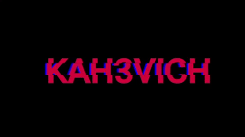
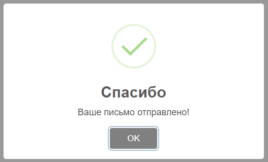
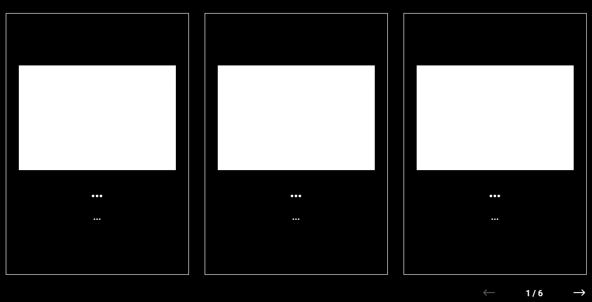
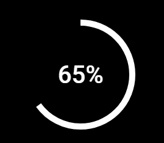

<h1 align="center">Project-Portfolio</h1>

## Support

Approve: Opera, Chrome, Yandex
Uncheck: Safari, Mozilla, IE

## Direction

- [Home](https://kah3vich.github.io/Project-Portfolio)
- [Calisthenic](https://kah3vich.github.io/calisthenica)
- [Movie](https://kah3vich.github.io/movie)
- [Music](https://kah3vich.github.io/music)
- [Programming](https://kah3vich.github.io/programming)

## Setups

### Scroll with NiceScroll

HTML

```html
<script src="https://code.jquery.com/jquery-3.5.1.min.js"></script>
<script src="https://cdnjs.cloudflare.com/ajax/libs/jquery.nicescroll/3.7.6/jquery.nicescroll.min.js"></script>
```

JS

```js
$(function () {
	$('body').niceScroll({
		scrollspeed: 9, // scroll speed
		mousescrollstep: 9, // scroll speed with the mouse wheel
		cursorcolor: 'transparent', // scroll color
		cursorborder: '1px solid transparent', // scroll outline
	});
});
```

### Animation with WOW


HTML

```html
<link
	rel="stylesheet"
	href="https://cdnjs.cloudflare.com/ajax/libs/animate.css/4.1.1/animate.min.css"
/>
<script src="https://cdn.rawgit.com/matthieua/WOW/1.0.1/dist/wow.min.js"></script>
```

```html
<div
	class="block wow fadeInUp"
	data-wow-delay="0.8s"
></div>
```

JS

```js
var wow = new WOW({
	mobile: false, // disable animation on mobile devices (depends on screen size)
});

wow.init(); // animation initialization
```

### Animation with GSAP

HTML

```html
<script src="https://code.jquery.com/jquery-3.5.1.min.js"></script>
<script src="https://cdnjs.cloudflare.com/ajax/libs/gsap/3.5.1/gsap.min.js"></script>
```

JS

```js
TweenMax.from('.block', 1.2, {
	y: 20,
	opacity: 0,
	ease: Expo.easeInOut,
	delay: 0,
});
```

### Circles from text


HTML

```html
<script src="https://code.jquery.com/jquery-3.5.1.min.js"></script>
<script src="https://rawgit.com/peterhry/CircleType/master/dist/circletype.min.js"></script>
```

```html
<h2
	class="block"
	id="block"
>
	test • test • test • test • test •
</h2>
```

JS

```js
const circle = new CircleType(document.getElementById('circle'));

$(window).scroll(function () {
	var offset = $(window).scrollTop();
	offset = offset * 0.4;

	$('.section__main-title-container__circle').css({
		'-moz-transform': 'rotate(' + offset + 'deg)',
		'-webkit-transform': 'rotate(' + offset + 'deg)',
		'-o-transform': 'rotate(' + offset + 'deg)',
		'-ms-transform': 'rotate(' + offset + 'deg)',
		transform: 'rotate(' + offset + 'deg)',
	});
});
```

### Header



HTML

```html
<h1
	class="section__main-title-wrapper-text"
	data-text="KAH3VICH"
>
	KAH3VICH
</h1>
```

CSS

```css
.section__main-title-wrapper-text {
	position: relative;
	color: crimson;
}
.section__main-title-wrapper-text::before,
.section__main-title-wrapper-text::after {
	content: attr(data-text);
	position: absolute;
	top: 0;
	left: 0;
	width: 100%;
	height: 100%;
}
.section__main-title-wrapper-text::before {
	left: 4px;
	text-shadow: -31px 0 rgb(0, 174, 255);
	background: black;
}
.section__main-title-wrapper-text::after {
	left: -3px;
	text-shadow: -3px 0 blue;
	background: black;
}
.section__main-title-wrapper-text::before {
	clip: rect(54px, 250px, 56px, 40px);
}
@keyframes noise-anim {
	0% {
		clip-path: inset(40% 0 61% 0);
	}
	20% {
		clip-path: inset(92% 0 1% 0);
	}
	40% {
		clip-path: inset(43% 0 1% 0);
	}
	60% {
		clip-path: inset(25% 0 58% 0);
	}
	80% {
		clip-path: inset(54% 0 7% 0);
	}
	100% {
		clip-path: inset(58% 0 43% 0);
	}
}
.section__main-title-wrapper-text::before {
	animation: noise-anim 2s infinite linear alternate-reverse;
}
.section__main-title-wrapper-text::after {
	animation: noise-anim 2s infinite linear alternate-reverse;
}
```

### Menu

HTML

```html
<script src="https://code.jquery.com/jquery-3.5.1.min.js"></script>
<script src="https://cdnjs.cloudflare.com/ajax/libs/gsap/3.5.1/gsap.min.js"></script>
```

```html
<div class="menu-open">
	<i
		class="fa fa-bars"
		aria-hidden="true"
	></i>
</div>

<div class="section__main-menu">
	<div class="menu-close">
		<i
			class="fa fa-times"
			aria-hidden="true"
		></i>
	</div>

	<div class="menu-links">
		<div class="link menu-link-1">
			<a href="#home">Home</a>
		</div>
		<div class="link menu-link-2">
			<a href="#live">About me</a>
		</div>
		<div class="link menu-link-3">
			<a href="#skills">Skills</a>
		</div>
		<div class="link menu-link-4">
			<a href="#work">Work</a>
		</div>
		<div class="link menu-link-5">
			<a href="#contact">Contact</a>
		</div>
	</div>
</div>
```

CSS

```css
.menu-open {
	position: absolute;
	margin: 30px 30px 0 0;
	right: 0;
	cursor: pointer;
}
.menu-close {
	position: absolute;
	margin: 17px 20px 0 0;
	right: 0;
	cursor: pointer;
}
.section__main-menu {
	position: fixed;
	width: 50%;
	height: 100vh;
	right: -50%;
	z-index: 2;
	background: #000;
	border-left: 2px solid #fff;
}
.menu-links {
	position: absolute;
	top: 50%;
	left: 50%;
	transform: translate(-50%, -50%);
	width: 80%;
	display: flex;
	flex-direction: column;
	justify-content: center;
	align-items: center;
	padding: 20px;
}
.menu-links .link {
	display: flex;
	justify-content: center;
	align-items: center;
	background: #000;
	margin: 4px 0;
	padding: 30px 0 16px 0;
}
.menu-links .link a {
	font-size: 32px;
	text-decoration: none;
	text-transform: uppercase;
	color: white;
}
.menu-link-1:hover,
.menu-link-2:hover,
.menu-link-3:hover,
.menu-link-4:hover,
.menu-link-5:hover {
	text-decoration: line-through;
}
```

JS

```js
let t1 = new TimelineMax({ paused: true });

t1.to('.section__main-menu', 0.4, {
	right: '0%',
});

t1.staggerFrom('.link', 0.4, { opacity: 0 }, 0.1, '-=0.2');

t1.reverse();
$(document).on('click', '.menu-open', function () {
	t1.reversed(!t1.reversed());
});
$(document).on('click', '.menu-close, .link', function () {
	t1.reversed(!t1.reversed());
});
```

### Dropdown sign



HTML

```html
<script src="https://cdn.jsdelivr.net/npm/promise-polyfill@8/dist/polyfill.js"></script>
<link
	rel="stylesheet"
	href="https://cdnjs.cloudflare.com/ajax/libs/limonte-sweetalert2/10.13.0/sweetalert2.min.css"
/>
```

JS

```js
swal('Thank you', 'Your letter has been sent!', 'success');
```

### Slider



HTML

```html
<link
	rel="stylesheet"
	href="https://unpkg.com/swiper/swiper-bundle.min.css"
/>
<script src="https://unpkg.com/swiper/swiper-bundle.min.js"></script>
```

```html
<div class="swiper-container">
	<div class="swiper-wrapper">
		<div class="swiper-slide">Slide 1</div>
		<div class="swiper-slide">Slide 2</div>
		<div class="swiper-slide">Slide 3</div>
	</div>
	<div class="swiper-pagination"></div>
	<div class="swiper-button-prev"></div>
	<div class="swiper-button-next"></div>
</div>
```

CSS

```css
.swiper-container {
	width: 600px;
	height: 300px;
}
```

JS

```js
var swiper = new Swiper('.swiper-container', {
	// declare the slider
	pagination: {
		// slad counter "1/6"
		el: '.swiper-pagination',
		type: 'fraction',
	},
	navigation: {
		// indicate navigation through arrows
		nextEl: '.swiper-button-next', // arrow - next slide
		prevEl: '.swiper-button-prev', // arrow - previous slide
	},
	speed: 700, // slides scroll speed
	breakpoints: {
		// slider adaptation
		1700: {
			// after screen size> 1700 the specified parameters will work
			slidesPerView: 3, // number of slides to be shown
			spaceBetween: 30, // padding between slides
		},
		1200: {
			slidesPerView: 2, // number of slides to be shown
			spaceBetween: 15, // padding between slides
		},
		992: {
			slidesPerView: 1, // number of slides to be shown
			spaceBetween: 5, // padding between slides
		},
	},
});
```

### Circle of progress



HTML

```html
<script src="https://code.jquery.com/jquery-3.5.1.min.js"></script>
<script src="https://cdnjs.cloudflare.com/ajax/libs/easy-pie-chart/2.1.6/jquery.easypiechart.min.js"></script>
```

```html
<div class="block">
	<div
		class="item"
		data-percent="65"
	>
		65%
	</div>
	<h2>Html</h2>
</div>
```

JS

```js
$(function () {
	$('.section__skills-block-item').easyPieChart({
		size: 180, // size block
		barColor: 'white', // color lime
		scaleColor: false, // addon border
		lineWidth: 10, // width line block
		trackColor: 'black', // background block
		lineCap: 'circle', // type line
		animate: 3000, // speed animation
	});
});
```

CSS

```css
.block {
	width: 25%;
	float: left;
}
.block h2 {
	text-align: center;
	color: #fff;
	text-transform: uppercase;
}
.block .item {
	position: relative;
	width: 180px;
	height: 180px;
	margin: 0 auto 19px;
	text-align: center;
	font-size: 40px;
	line-height: 180px;
	color: #fff;
}
.block canvas {
	position: absolute;
	top: 0;
	left: 0;
}
```

## Materials

- [EasyPieChart](https://github.com/rendro/easy-pie-chart)
- [Giphy](https://giphy.com)
- [FontAwesome](https://fontawesome.com)
- [Squoosh](https://squoosh.app)
- [PixelPlus](https://pixelplus.ru/samostoyatelno/stati/vnutrennie-faktory/tablica-simvolov-unicode.html)
- [Jquery](https://jquery.com/download)
- [NiceScroll](https://github.com/inuyaksa/jquery.nicescroll)
- [Swiper](https://swiperjs.com)
- [SweetaAlert2](https://github.com/sweetalert2/sweetalert2)
- [AnimateStyle](https://animate.style)
- [WOW](https://github.com/graingert/wow)
- [GSAP](https://greensock.com)
- [CircleType](https://github.com/peterhry/CircleType)
